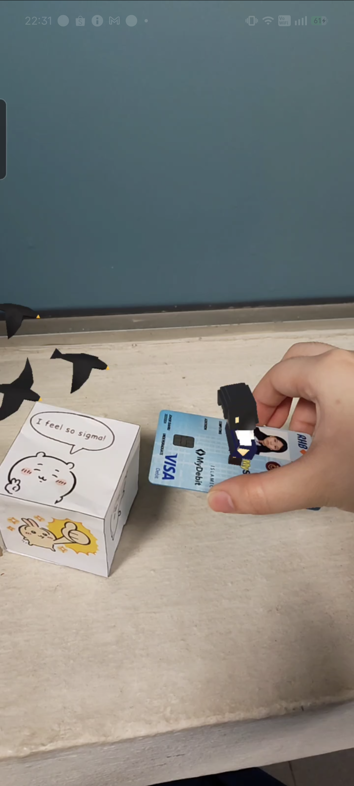
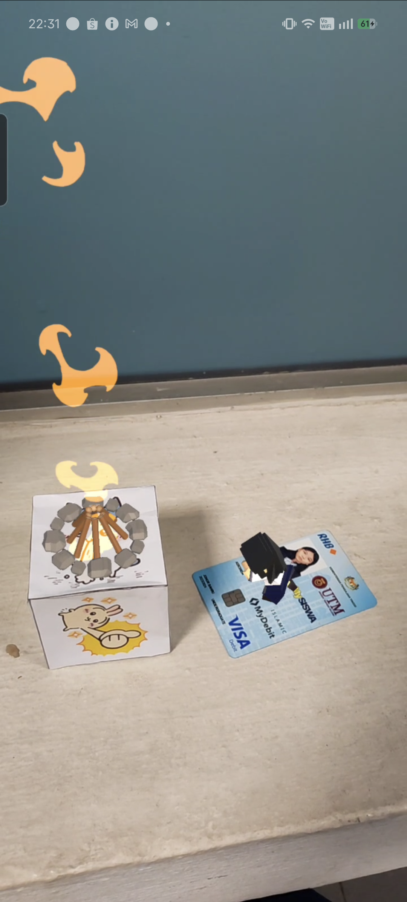
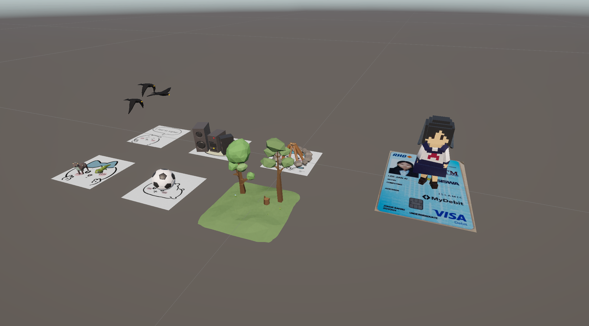
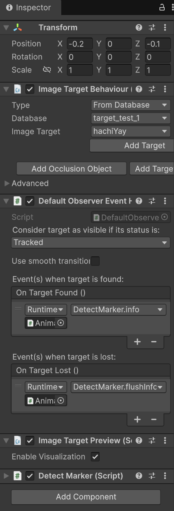

# MagicCube-RTCG-Assignment

This is an individual assignment of the course SECV3123 Real-Time Computer Graphics. 

 

## Engine Used:

* Unity (6000.3.12f1)  
* Vuforia Engine

 

## Screenshots of Development

